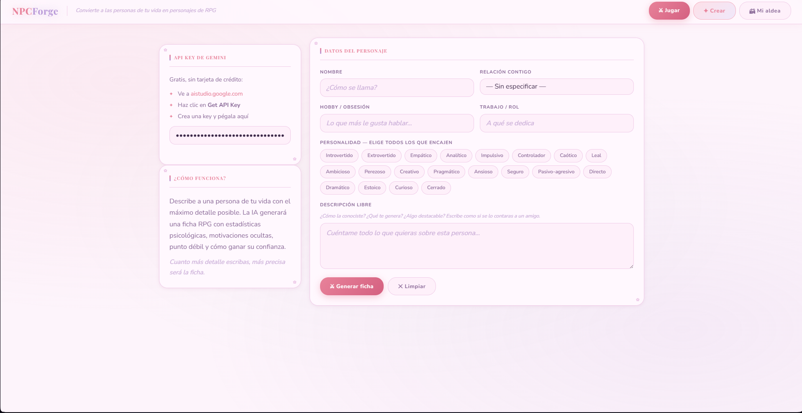
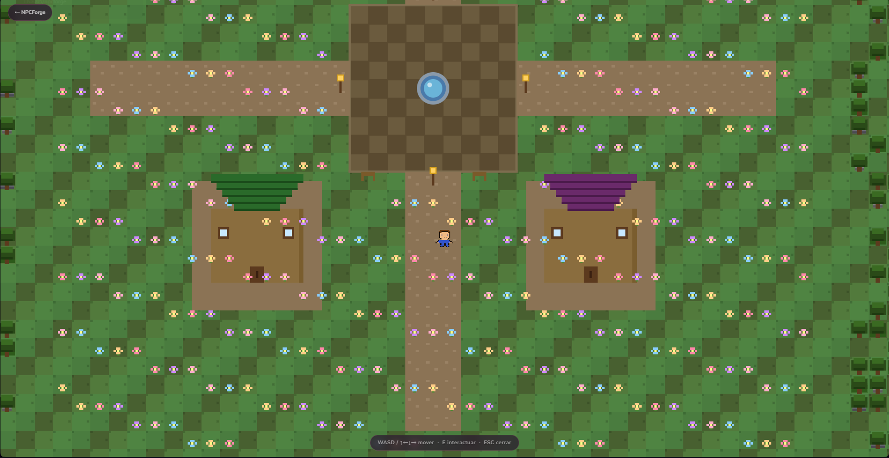

<div align="center">

# 🌸 NPCForge ✨

**De la vida real a tu propia aldea virtual 🎀**

*Convierte a las personas de tu entorno en NPCs interactivos con análisis psicológico generado por IA ⚡*


</div>

---

## 💜 ¿Qué es NPCForge?

Describes a alguien de tu vida. La IA genera una **ficha RPG psicológica** completa — stats, motivación oculta, punto débil, cómo ganarte su confianza y misiones de relación 🔮

Luego diseñas su sprite en pixel art, lo guardas en tu aldea, y puedes **explorar un mapa top-down** donde caminarás por una aldea con casas, plaza y NPCs que deambulan libremente y responden en personaje gracias a la IA ⚡

---

## 📸 Screenshots

<div align="center">

### ✦ Generador de fichas RPG


### ✦ Aldea explorable


</div>

---

## 🌟 Lo que ya funciona

✅ Generación de ficha RPG completa con IA (Mistral)  
✅ 6 stats psicológicos animados  
✅ Editor de sprite pixel art 16×16  
✅ Galería "Mi aldea" con tarjetas  
✅ Mapa top-down explorable — plaza, casas, caminos, decoración  
✅ Una casa por cada NPC con tejado de color único  
✅ NPCs con movimiento libre (wandering por su zona)  
✅ Avatar del jugador personalizable  
✅ Chat con NPCs en personaje vía Mistral  
✅ Teclado capturado correctamente durante el chat  
✅ Sin servidor, sin registro — todo en `localStorage` 🌷  

---

## 🗂️ Estructura

```
npcforge/
├── index.html
├── screenshots/
│   ├── screen_app.png
│   └── screen_game.png
├── css/
│   ├── base.css
│   ├── layout.css
│   └── sheet.css
├── js/
│   ├── storage.js
│   ├── gemini.js        ← Mistral API
│   ├── sprite-editor.js
│   └── app.js
└── game/
    ├── index.html
    ├── css/
    │   └── game.css
    └── js/
        ├── world.js     ← Mapa Phaser
        └── dialog.js    ← Chat con NPCs
```

---

## 🗺️ Hoja de ruta

### 🐛 Bugs pendientes
- [ ] 🐛 Colisiones con casas y árboles — revisar solidGroup

### 🏗️ Fase 3 — Mapa rico *(en progreso)*
- [x] 🏛️ Plaza central con adoquines y fuente
- [x] 🏠 Una casa por cada NPC guardado con tejado de color único
- [x] 🧍 NPCs con movimiento libre por su zona
- [x] 🪑 Decoración — bancos, faroles, señal de bienvenida
- [x] 🛤️ Caminos conectando casas con la plaza
- [ ] 🌲 Bosque exterior denso con colisiones
- [ ] 🏷️ Nombre del NPC visible encima del sprite en el mapa

### 📋 Fase 4 — Sistema de misiones
- [ ] 📌 HUD con las 3 misiones activas de cada NPC
- [ ] ✅ Marcar misiones como completadas
- [ ] 🎉 Evento / recompensa al completar una misión
- [ ] 📜 Historial de misiones completadas

### 📈 Fase 5 — Relaciones vivas
- [ ] 💹 Stats que evolucionan según cómo hablas con el NPC
- [ ] 🔔 Indicador visual de cambio de stat tras conversación
- [ ] ❤️ Nivel de relación global (desconocido → aliado → rival…)

### 🎮 Fase 6 — Animaciones
- [ ] 🚶 Caminar en 4 direcciones (sprite sheet)
- [ ] 💤 Idle animation
- [ ] 🌀 Animación de NPCs más natural

### 📱 Fase 7 — App nativa
- [ ] 🖥️ Versión de escritorio (Electron o Tauri)
- [ ] 📱 Versión móvil (Capacitor o PWA)
- [ ] 🕹️ Controles táctiles para el mapa

### 🌐 Fase 8 — Servidor y multijugador
- [ ] 🗄️ Backend propio (Node.js + base de datos)
- [ ] 🔐 Registro y login de usuarios
- [ ] ☁️ Aldeas guardadas en la nube
- [ ] 👥 Multijugador — *por definir* (¿visitar aldeas ajenas? ¿eventos globales? ¿NPCs compartidos?)

### 🌈 Ideas futuras
- [ ] 📸 Exportar ficha como imagen compartible
- [ ] ⚖️ Comparar dos NPCs
- [ ] 💾 Backup / import JSON de la aldea completa
- [ ] 🌍 Explorar aldeas públicas de otros jugadores
- [ ] 🎵 Música y efectos de sonido ambient
- [ ] 🌦️ Ciclo día/noche en el mapa

---

## 🛠️ Stack actual

🍦 **Vanilla JS** — sin frameworks, sin npm  
🤖 **Mistral AI** — `mistral-small-latest`, free tier  
🎮 **Phaser 3** — motor 2D via CDN  
💾 **localStorage** — persistencia local  
🎨 **CSS custom properties** — theming completo  

## 🔭 Stack futuro *(tentativo)*

🖥️ **Electron / Tauri** — app de escritorio  
📱 **Capacitor / PWA** — app móvil  
⚙️ **Node.js + Express** — servidor  
🗄️ **PostgreSQL o SQLite** — base de datos  
🔌 **WebSockets** — tiempo real para multijugador  

---

<div align="center">

*Hecho con demasiado amor, mangoloco y ganas 💜*

por ahora nada más, se continua después de una peli o algo así

</div>